# Deep Structured State Learning for Next-Period Recommendation

This repository contains the official PyTorch implementation of:

**Deep Structured State Learning for Next-Period Recommendation.**  




**Abstract:** User activities in real systems are usually time-sensitive. But most of the existing sequential models in recommender systems neglect the time-related signals. In this paper, we find that users' temporal behaviours tend to be driven by their regularly-changing states, which provides a new perspective on learning users' dynamic preference. However, since the individual state is usually latent, the event space is high dimensional, and meanwhile temporal dependency of states is personalized and complex, it is challenging to represent, model and learn the time-evolving patterns of user's state. Focusing on these challenges, we propose a Deep Structured State Learning (DSSL) framework which is able to learn the representation of temporal states and the complex state dependency for time-sensitive recommendation. Extensive experiments demonstrate that DSSL achieves competitive results on four real-world recommendation datasets. Furthermore, experiments also show some interesting rules for designing the state dependency network.

## Requirements

* Python 3.7.5
* PyTorch version 1.3.1
* numpy version 1.17.4
* scipy version 1.3.2
* pandas version 0.25.3
* tqdm version 4.40.0

The experiments were conducted on GPUs(GeForce RTX 2080 Ti) with Ubuntu 18.04.1 LTS.

## Prepare datasets
Dataset | #Users | #Items | Density | Cutting Date
---|---|---|---|---
IPTV|2,920|32,341|2.3590%|Nov 2,15
NYC|1,083|38,333|0.5478%|Jan 1,13
TKY|2,293|61,858|0.4045%|Jan 1,13
Gowalla|1,048|39,386|1.3809%|Aug 30, 10

## Run model training and evaluation

**training script**:
```bash
python train.py --dataset='data/NYC/nyc_train_week.pt' --save-folder='results/DSSL_nyc' \
              --meta-name='model_metadata.pkl' --model-name='model_weight.pt' \
              --epochs=150 --batch-size=8 --learning-rate=1e-4 --num-workers=5 --weight-decay=0.0001 \
              --q-dims 38333 300 50 --p-dims 50 300 38333 --keep-prob=0.1 --anneal=1 --feature-dim=1083 \
              --state-net='gnn' --gpu=0
```
**evaluation script**
```bash
python eval.py --save-folder='results/DSSL_nyc' \
              --testset='data/NYC/nyc_eval_week.pt' \
              --meta-name='model_metadata.pkl' --model-name='model_weight.pt' \
              --batch-size=64 --num-workers=5 --gpu=0
```
### Cite
If you make use of this code in your own work, please cite our paper:
```
@ARTICLE{9785370,
    author={Wen, Wen and Liang, Fangyu},
    journal={IEEE Transactions on Neural Networks and Learning Systems},
    title={Deep Structured State Learning for Next-Period Recommendation},
    year={2022},
    pages={1-13},
    doi={10.1109/TNNLS.2022.3176409}
}
```